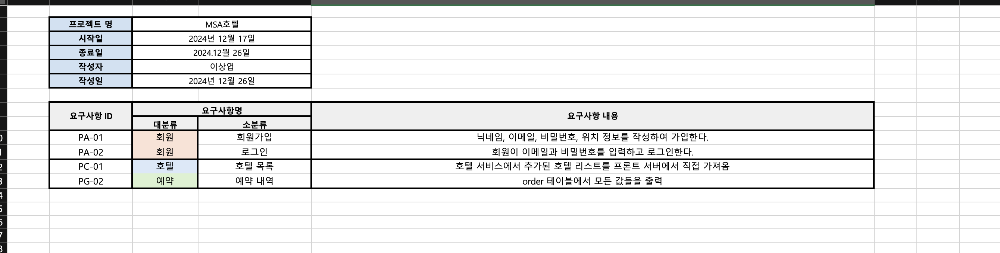

# 프로젝트 소개

## 프로젝트명
**MSA를 이용한 호텔 예약 서비스**

---

## 팀원
- **이상엽**
- **김선영**
- **김민지**

---

## 프로젝트 개요
MSA(Microservice Architecture)를 활용하여 호텔 예약 서비스를 구축한 프로젝트입니다.

---

## 팀원 역할 분담
- **이상엽**: Booking Service, Front Server 개발
- **김선영**: Hotel Service 개발
- **김민지**: User Service 개발

---

## 기술 스택
- **Frontend**: Thymeleaf
- **Backend**: Spring Boot, Java, MySQL

---

## 요구사항 명세서

---

## 화면 설계서
1. **메인 페이지**
   

2. **호텔 리스트 페이지**
   

3. **호텔 상세 페이지**
   

4. **예약 확인 페이지**
   

5. **관리자 페이지**
   

---

